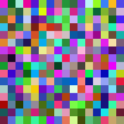

# Genetic Colors
This is a simple genetic algorithm I put togther that creates a population of RGB colors and attempts to evolve them into a specific shade of blue. For each generation it generates an image frame to show the population and it also outputs the mean population score.

```
$ python3 gencolors/__main__.py
```



## License
The source code for Genetic Colors is available under the MIT License, see `LICENSE` for more information.
